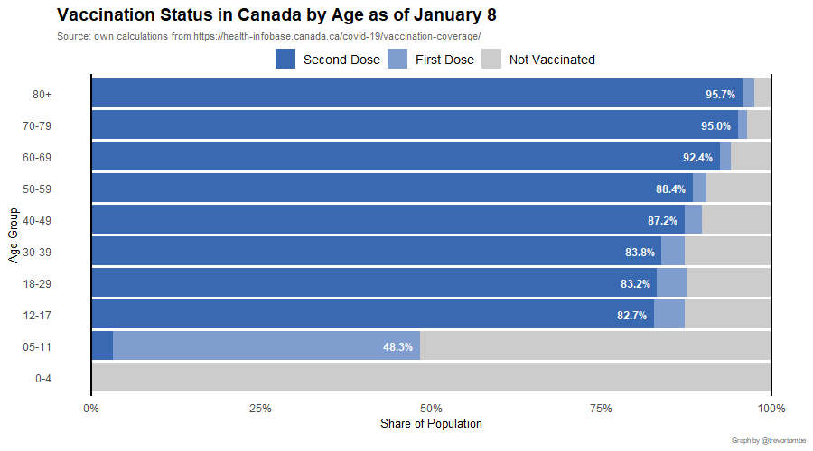
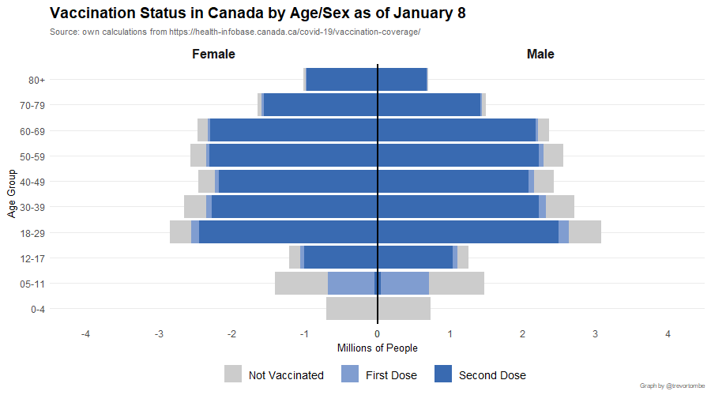
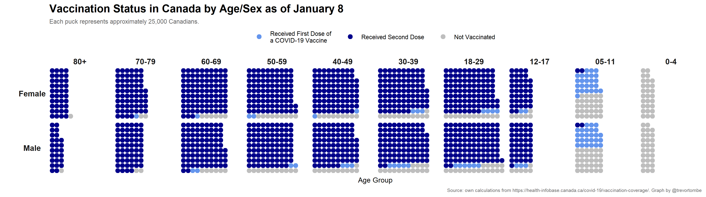

Vaccination rates by detailed age and sex are available through the federal government [here](https://health-infobase.canada.ca/covid-19/vaccination-coverage/). This data is released on a weekly basis, normally each Friday, and covers the previous week up to Saturday. 

