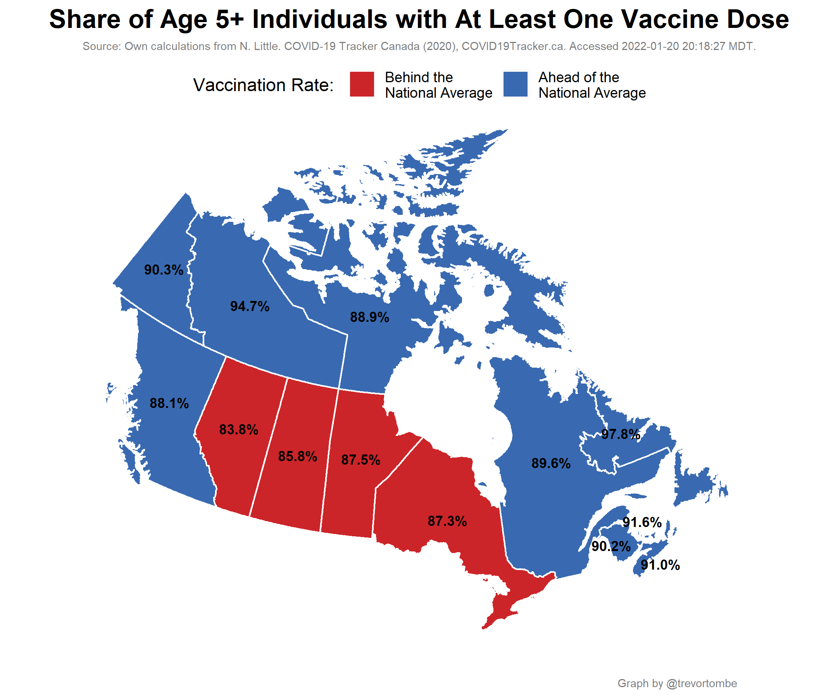
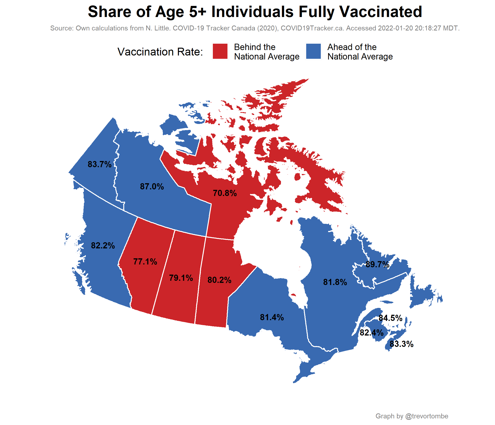
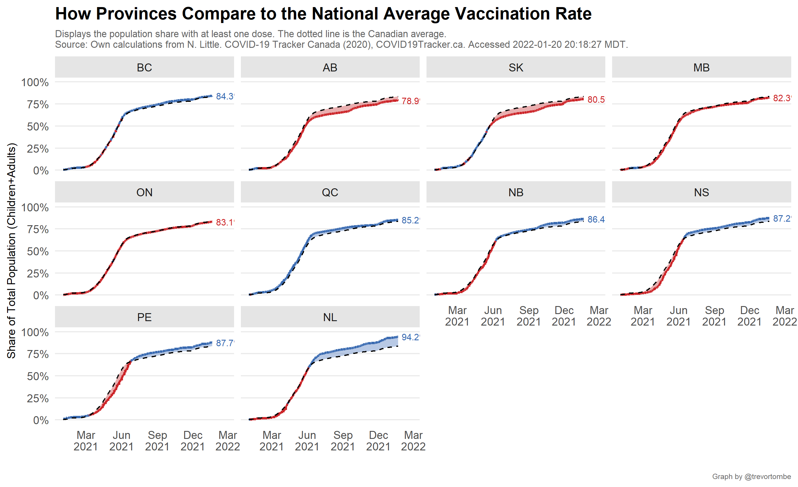
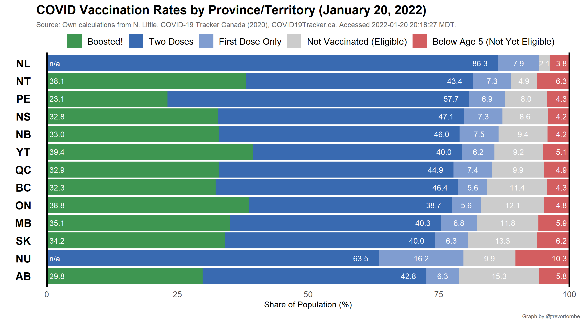
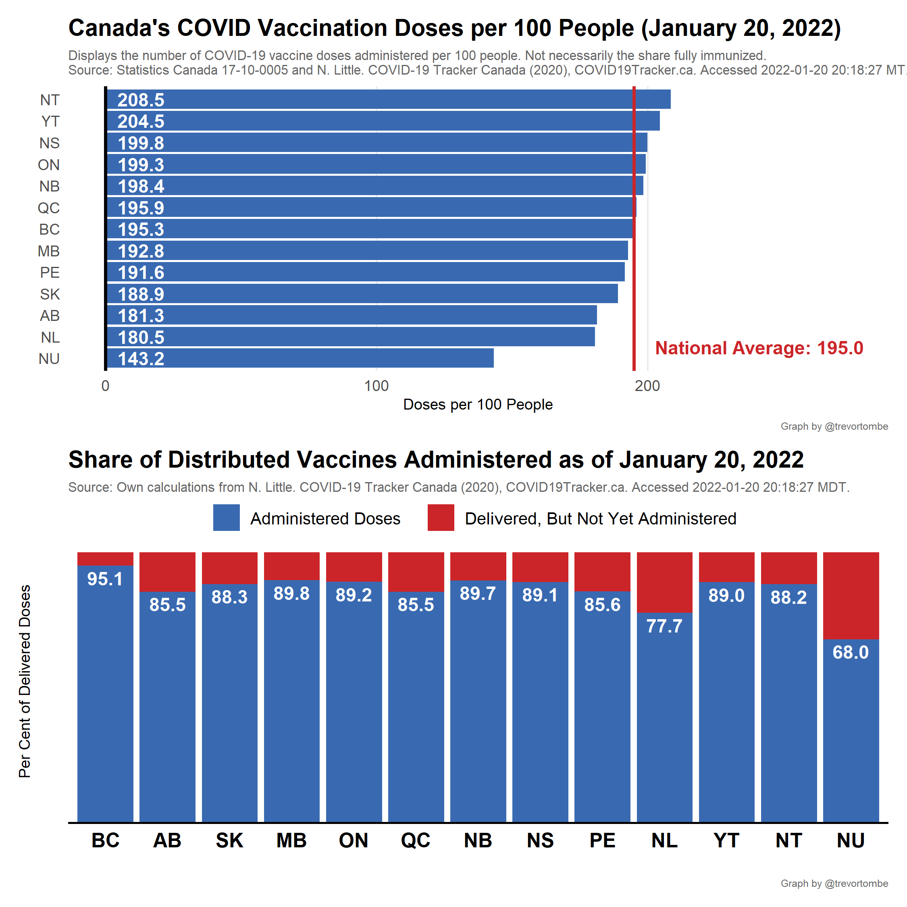
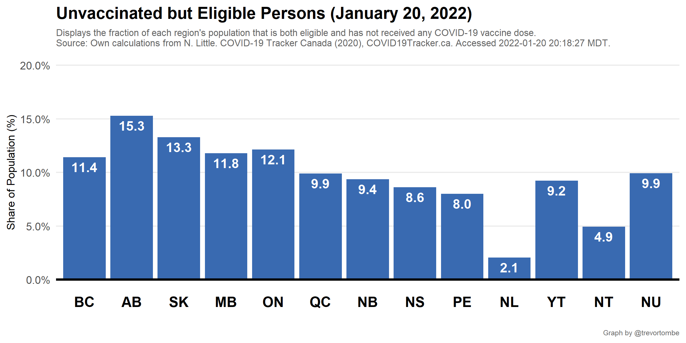
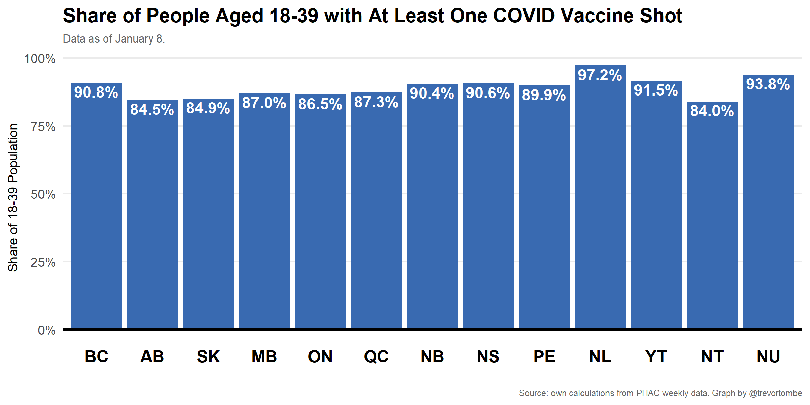

In Canada, vaccine doses are procured by the federal government and distributed to provinces for administration. Provinces set their own policies around who is eligible, length between first and second shots, and so on. To compare each province's vaccination rates, the following plots illustrate several relevant metrics.

---

---

