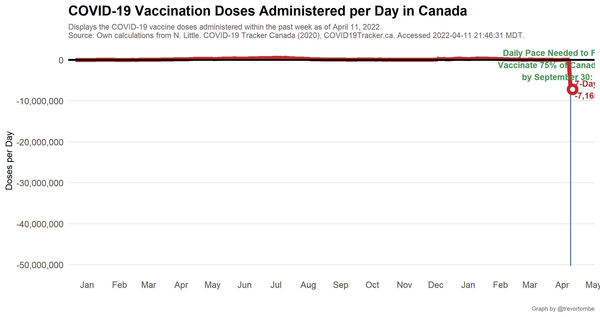

COVID-19 Vaccination in Canada
==============================

**Welcome!** This website provides several visualizations of COVID-19
vaccination progress in Canada based on data collected mainly from
[COVID Canada](https://covid19tracker.ca/vaccinationtracker.html) and
[Our World in Data](https://ourworldindata.org/covid-vaccinations). The
latest federal distribution schedule is [available
here](https://www.canada.ca/en/public-health/services/diseases/2019-novel-coronavirus-infection/prevention-risks/covid-19-vaccine-treatment/vaccine-rollout.html).
The information below was last updated at 2021-06-07 17:07:39 MDT.

COVID vaccination update for June 7, 2021:

-   Total shots given: 26,499,709
-   Shots per 100 people: 69.7
-   Shots reported today \*: 404,245
-   Inventory: 8.9 days (at avg pace)
-   Adults w/ 1+ Shots: 73.1%

Source:
<a href="https://covid19tracker.ca/vaccinationtracker.html" class="uri">https://covid19tracker.ca/vaccinationtracker.html</a>

Note: Includes some weekend doses

In total, Canada is now up to 26.5 million shots given – which is 88.8%
of the total 29.8 million doses available. Over the past 7 days,
3,797,718 doses have been delivered to provinces.

And so far 3.0 million are fully vaccinated with two shots.

Canada’s daily pace:

Today’s 404,245 shots given compares to an average of 376,759/day over
the past week and 354,408/day the week prior.

-   Pace req’d for 2 doses to 75% of Canadians by Sept 30: 265,324
-   At current avg pace, we reach 75% by Aug 26

------------------------------------------------------------------------

Explore other visualizations by clicking on the appropriate menu item at
the top of this page. Enjoy!
