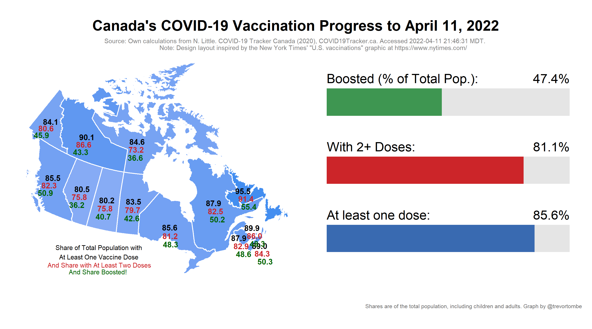

COVID-19 Vaccination in Canada
==============================

**Welcome!** This website provides several visualizations of COVID-19
vaccination progress in Canada based on data collected mainly from
[COVID Canada](https://covid19tracker.ca/vaccinationtracker.html) and
[Our World in Data](https://ourworldindata.org/covid-vaccinations). The
latest federal distribution schedule is [available
here](https://www.canada.ca/en/public-health/services/diseases/2019-novel-coronavirus-infection/prevention-risks/covid-19-vaccine-treatment/vaccine-rollout.html).
The information below was last updated at 2021-06-30 17:06:40 MDT.

COVID vaccination update for June 30, 2021 (reports as of 7 PM ET):

-   Total shots given: 37,384,318
-   Shots per 100 people: 97.7
-   Shots reported: 608,885
-   Inventory: 15.6 days (at avg pace)
-   Adults w/ 1+ Shots: 78.0%

Source:
<a href="https://covid19tracker.ca/vaccinationtracker.html" class="uri">https://covid19tracker.ca/vaccinationtracker.html</a>

In total, Canada is now up to 37.4 million shots given – which is 81.6%
of the total 45.8 million doses available. Over the past 7 days, 8.2
million doses have been delivered to provinces.

And so far 11.7 million are fully vaccinated with two shots.

Canada’s daily pace:

Our 7-day average pace of administering shots: 542,707/day over the past
week and 457,963/day the week prior.

We can use the latest average daily pace to project where vaccination
rates are soon headed.

------------------------------------------------------------------------

Explore other visualizations by clicking on the appropriate menu item at
the top of this page. Enjoy!
