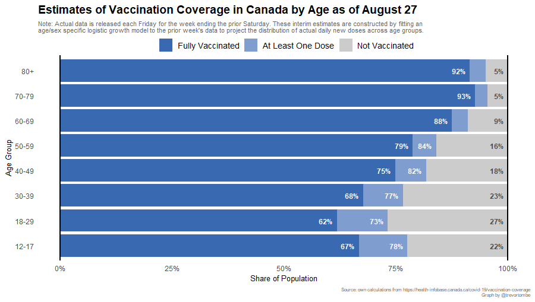
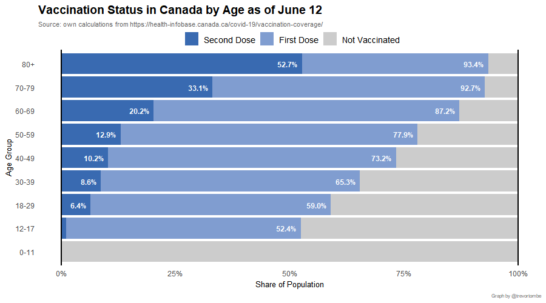
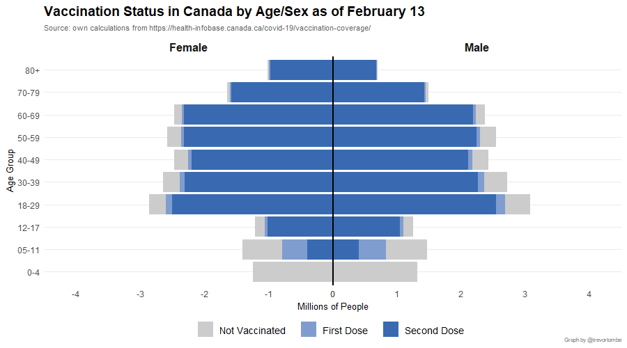
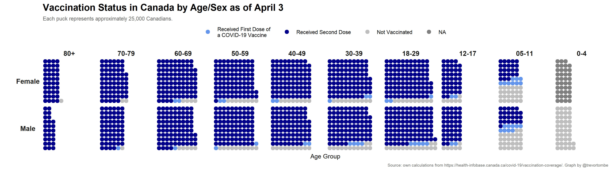

Vaccination rates by detailed age and sex are available through the federal government [here](https://health-infobase.canada.ca/covid-19/vaccination-coverage/). This data is released on a weekly basis, normally each Friday, and covers the previous week up to Saturday. To get a sense of daily updated vaccination rates by detailed age categories, I project forward based on a logistic growth model calibrated to match the week-over-week changes in the actual data. The latest results of that estimate is displayed below.

---

The actual data follows, though not it features a long lag.

