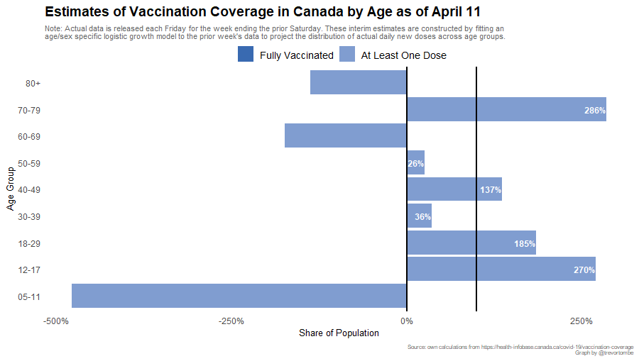

Vaccination rates by detailed age and sex are available through the federal government [here](https://health-infobase.canada.ca/covid-19/vaccination-coverage/). This data is released on a weekly basis, normally each Friday, and covers the previous week up to Saturday. To get a sense of daily updated vaccination rates by detailed age categories, I project forward based on a logistic growth model calibrated to match the week-over-week changes in the actual data. The latest results of that estimate is displayed below.

---

The actual data follows, though it features a long lag.

---

The following was updated on May 18:

<iframe title="Proportion of Albertans with a COVID Vaccine Dose" aria-label="Stacked Bars" id="datawrapper-chart-inMOI" src="https://datawrapper.dwcdn.net/inMOI/1/" scrolling="no" frameborder="0" style="width: 0; min-width: 100% !important; border: none;" height="720"></iframe>
