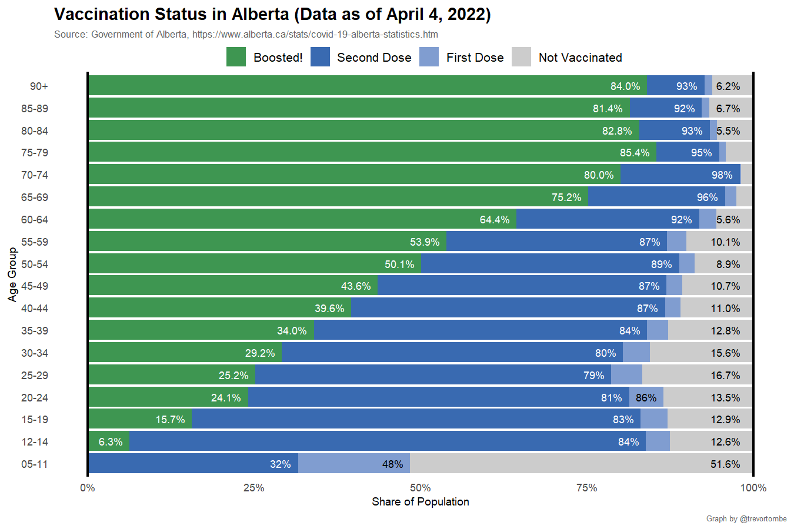
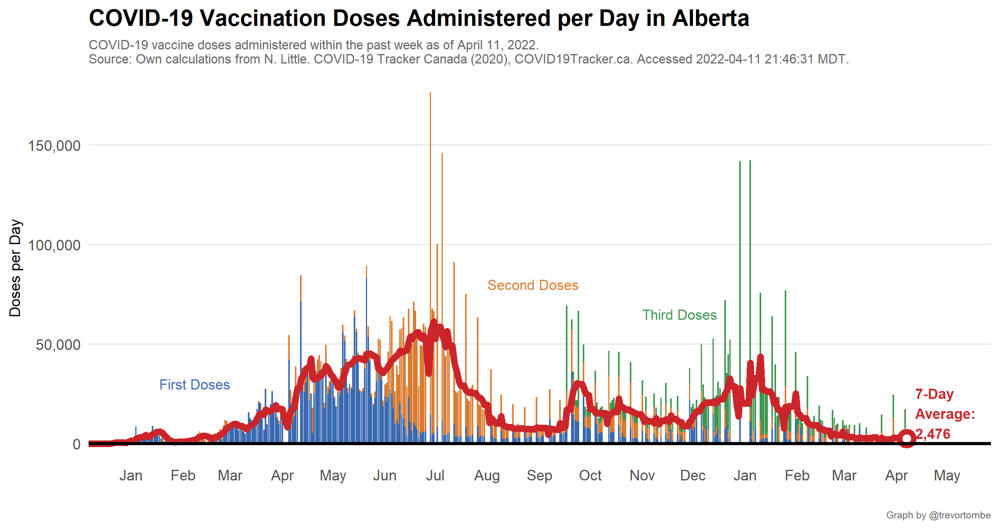
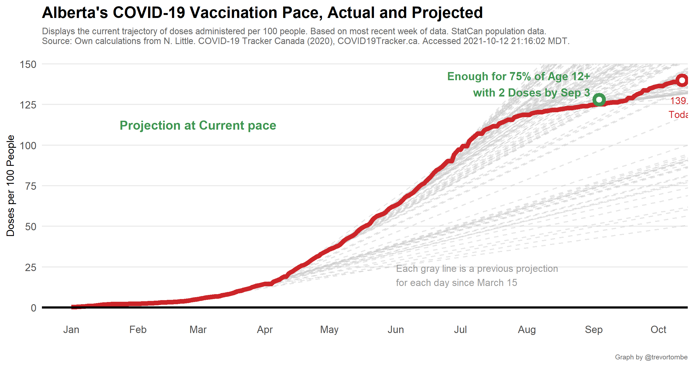
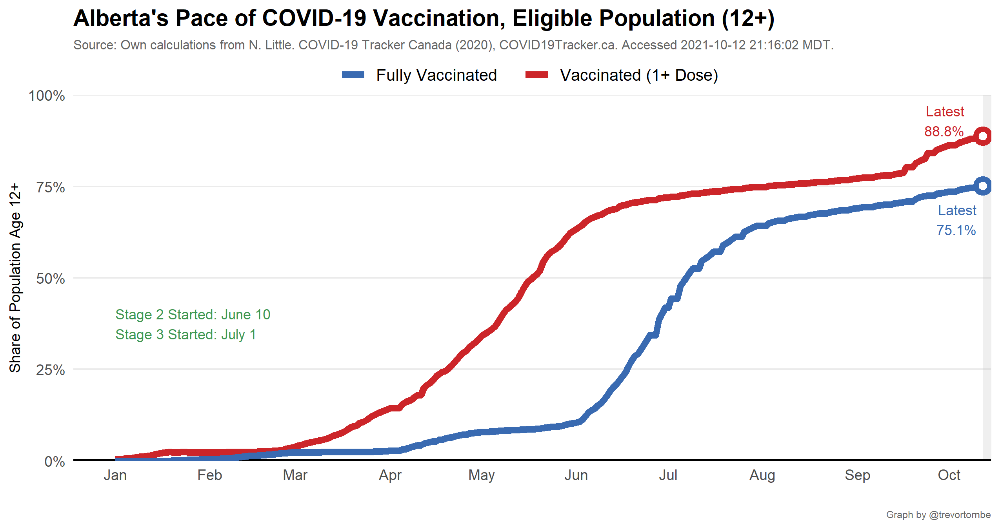
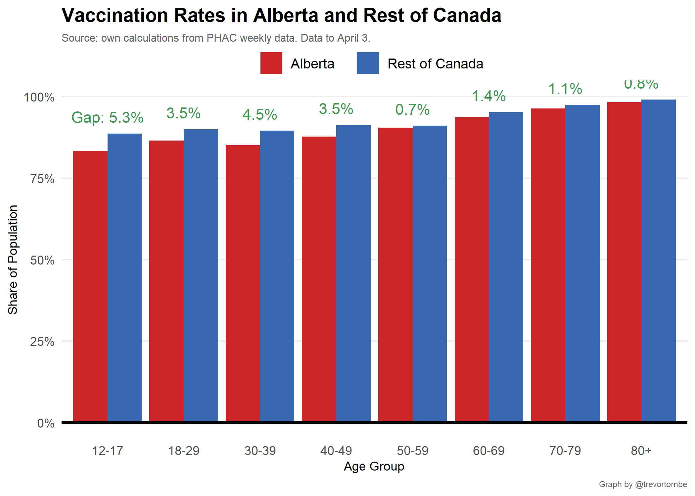
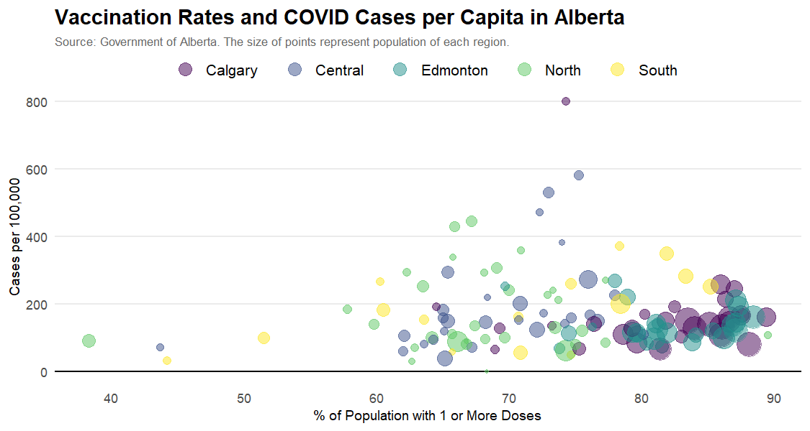
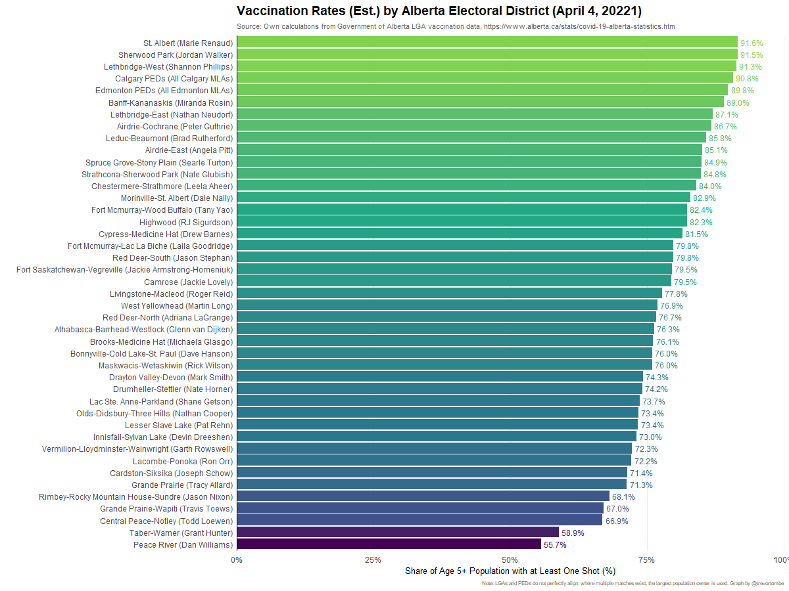
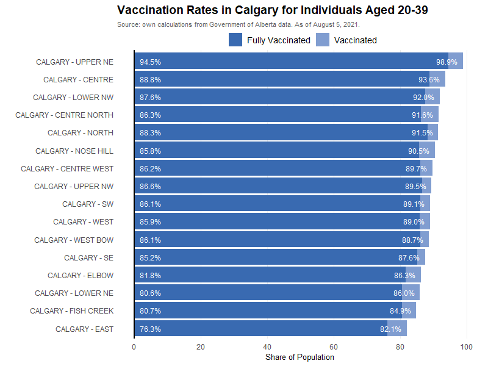

---

In Alberta, there is significant variation across the province in vaccination rates. Community leaders may be important to encourage vaccination uptake. So, here's a set of experimental estimates of vaccination rates by Provincial Electoral Districts. To do this, I assign each of the 132 LGAs to one of the 87 electoral districts. Where ambiguity exists, I use the largest population center.

---

Zooming into Calgary (selfishly) for younger individuals reveals encouragingly high vaccination rates, much higher than the overall provincial averages suggest.

