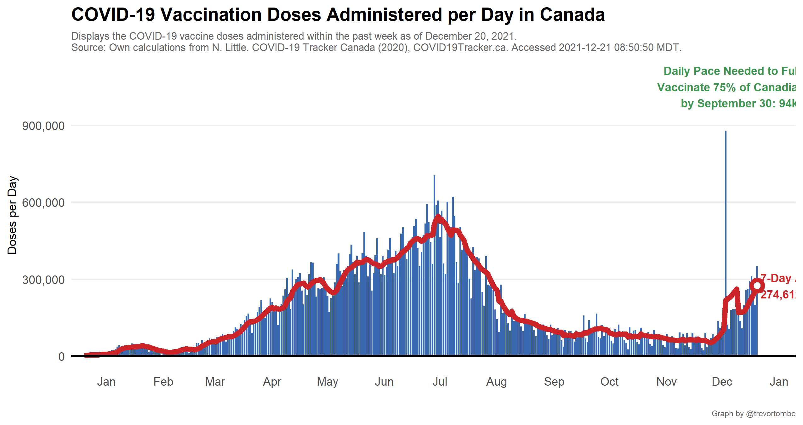

**Welcome!** This website provides several visualizations of COVID-19 vaccination progress in Canada based on data collected mainly from [COVID Canada](https://covid19tracker.ca/vaccinationtracker.html) and [Our World in Data](https://ourworldindata.org/covid-vaccinations). The latest federal distribution schedule is [available here](https://www.canada.ca/en/public-health/services/diseases/2019-novel-coronavirus-infection/prevention-risks/covid-19-vaccine-treatment/vaccine-rollout.html). The information below was last updated at `r accessed` MDT. For regular progress bar updates, follow <a href="https://twitter.com/CDNVaccineCount" class="uri">@CDNVaccineCount</a> on twitter.

`r paste0(paste0("COVID vaccination update for ",gsub(" 0"," ",format(accessed,"%B %d, %Y")),":\n\n"),
                    ifelse(wday(today)==2,paste0("- Shots reported today *: ",new_doses,"\n"),
                           paste0("- Shots reported today: ",new_doses,"\n")),
                    "- Total shots given: ",total_doses,"\n",
                    "- Age 12+ w/ 1+ Shots: ",age12_vaccinated,"\n",
                    "- Age 18+ w/ 1+ Shots: ",adult_share_experimental," (est)\n",
                    "- Shots per 100 people: ",number(pop_share*100,.1),"\n",
                    "- People fully vaccinated: ",comma(latest$full),"\n",
                    "- Doses distributed: ",comma(latest$dist),"\n",
                    "- Share of distributed doses administered: ",share_dist_used,"\n",
                    "- Inventory: ",inventory," days (at avg pace)\n",
                    "- Days to 75/20 target: ",round(tamdate$totam),"\n",
                    "\n\nSource: https://covid19tracker.ca/vaccinationtracker.html",
                    ifelse(wday(today)==7 | wday(today)==1,"\n\nNote: Weekend updates are incomplete",""),
                    ifelse(wday(today)==2,"\n\nNote: Includes some weekend doses",""))`

<iframe title="COVID Vaccination Progress in Canada" aria-label="table" id="datawrapper-chart-d3PPr" src="https://datawrapper.dwcdn.net/d3PPr/2/" scrolling="no" frameborder="0" style="width: 0; min-width: 100% !important; border: none;" height="601"></iframe>

`r third_tweet`

And a measure of effective coverage:

---

Explore other visualizations by clicking on the appropriate menu item at the top of this page. Enjoy!