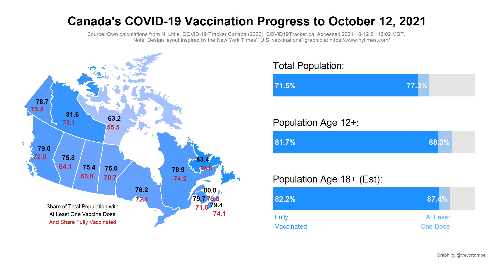
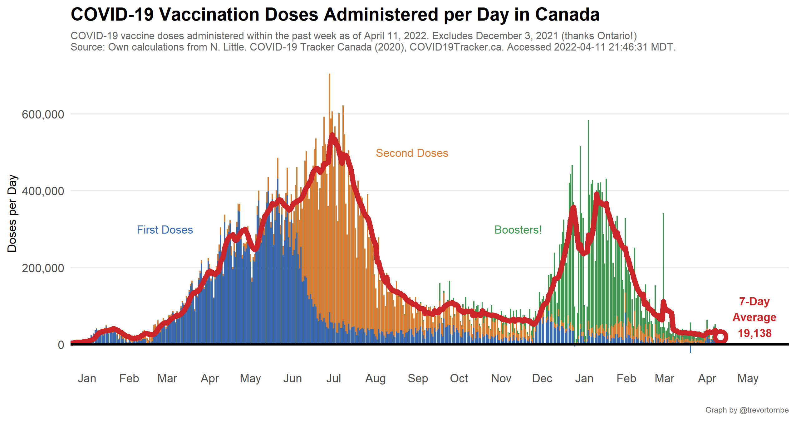
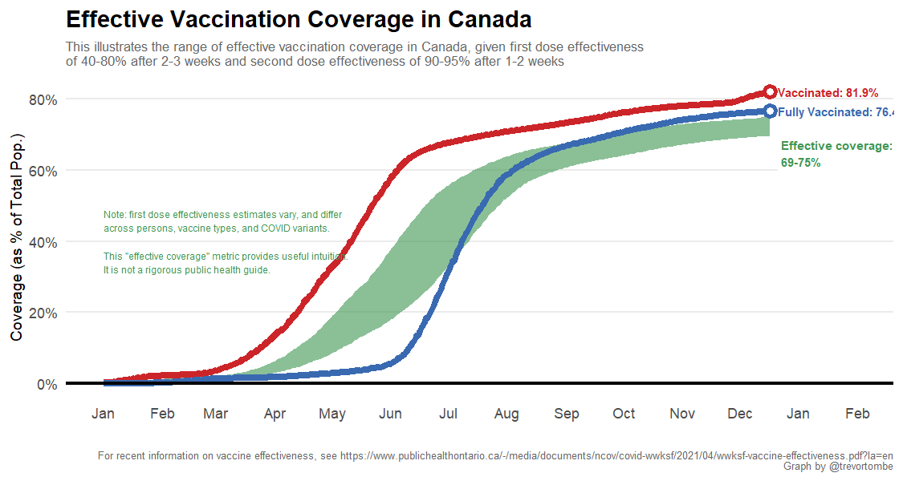

**Welcome!** This website provides several visualizations of COVID-19 vaccination progress in Canada based on data collected mainly from [COVID Canada](https://covid19tracker.ca/vaccinationtracker.html) and [Our World in Data](https://ourworldindata.org/covid-vaccinations). The latest federal distribution schedule is [available here](https://www.canada.ca/en/public-health/services/diseases/2019-novel-coronavirus-infection/prevention-risks/covid-19-vaccine-treatment/vaccine-rollout.html). The information below was last updated at `r accessed` MDT. For regular progress bar updates, follow <a href="https://twitter.com/CDNVaccineCount" class="uri">@CDNVaccineCount</a> on twitter. Note: I use the [Statistics Canada real-time population estimates](https://www150.statcan.gc.ca/n1/pub/71-607-x/71-607-x2018005-eng.htm) as the basis for most of shares reported on this site. Other sources may differ for this reason.

`r paste0(paste0("COVID vaccination update for ",gsub(" 0"," ",format(accessed,"%B %d, %Y"))," (reports as of ",tweet_time," ET)",":\n\n"),
                    ifelse(wday(today)==2,paste0("- Shots reported today *: ",new_doses),
                           paste0("- Shots reported today: ",new_doses)),
                           " (",percent(filter(first_second_share,date==max(date) & type=="second_share")$val,1)," 2nd doses)",
                    "\n- Total shots given: ",total_doses,"\n",
                    "- Age 12+ w/ 1+ Shots: ",age12_vaccinated,"\n",
                    "- Age 18+ w/ 1+ Shots: ",adult_share_experimental," (est)\n",
                    "- Shots per 100 people: ",number(pop_share*100,.1),"\n",
                    "- People fully vaccinated: ",comma(latest$full),"\n",
                    "- Doses distributed: ",comma(latest$dist),"\n",
                    "- Share of distributed doses administered: ",share_dist_used,"\n",
                    "- Inventory: ",inventory," days (at avg pace)\n",
                    #"- Days to 75/20 target: ",round(tamdate$totam),"\n",
                    "\n\nSource: https://covid19tracker.ca/vaccinationtracker.html",
                    ifelse(wday(today)==7 | wday(today)==1,"\n\nNote: Weekend updates are incomplete",""),
                    ifelse(wday(today)==2,"\n\nNote: Includes some weekend doses",""))`

<iframe title="COVID Vaccination Progress in Canada" aria-label="table" id="datawrapper-chart-d3PPr" src="https://datawrapper.dwcdn.net/d3PPr/2/" scrolling="no" frameborder="0" style="width: 0; min-width: 100% !important; border: none;" height="601"></iframe>

`r third_tweet`

And finally, dose counts and the share of a population with a shot is informative and important, but the population-level effective protection this provides is lower. One dose is less effective than two, plus there are lags in the vaccine's effect along with numerous uncertainties (especially where the variants are concerned). Based on a first-dose efficacy of between 40 to 80 percent with a 2-3 week lag and a second dose efficacy of 90 to 95 percent with a 0 to 2 week lag, our current coverage of effective protection is between `r paste0(round(100*filter(plotdata_effective,date==max(date))$low_est),
                        " to ",round(100*filter(plotdata_effective,date==max(date))$high_est))` percent. The margin of error here is wide, which reflects the high degree of variation in efficacy estimates and uncertainty with new variants. This is meant to provide intuition and rough magnitudes, it does not rigorous public health guidance. Follow your local public health agency's guidelines! 

For a useful summary of the research literature, see [this report from Public Health Ontario](https://www.publichealthontario.ca/-/media/documents/ncov/covid-wwksf/2021/04/wwksf-vaccine-effectiveness.pdf?la=en).

---

As the share of the population with their first dose is growing large, provinces the number of second doses will accelerate and the interval between jabs shrink. Here's the latest:

Explore other visualizations by clicking on the appropriate menu item at the top of this page. Enjoy!
