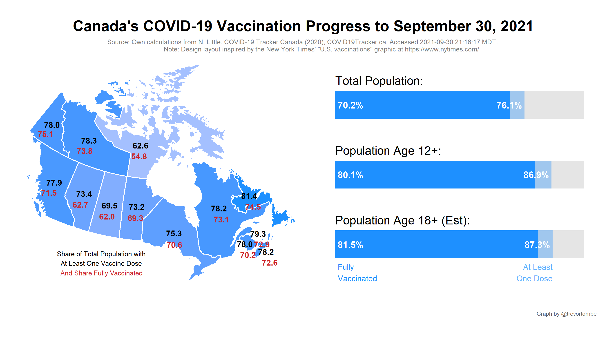
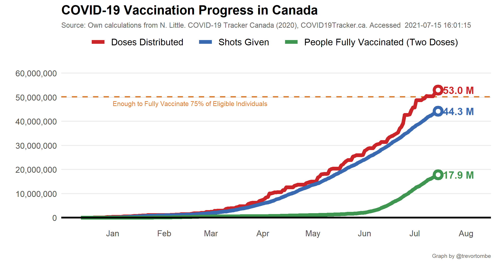
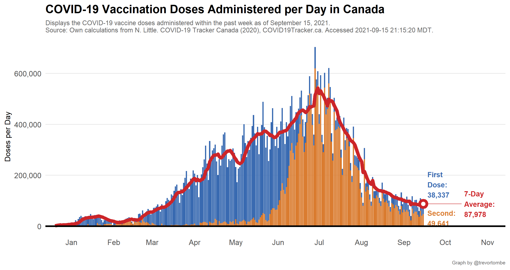
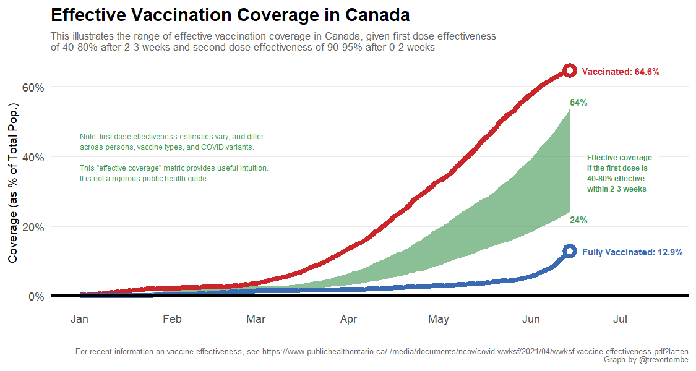
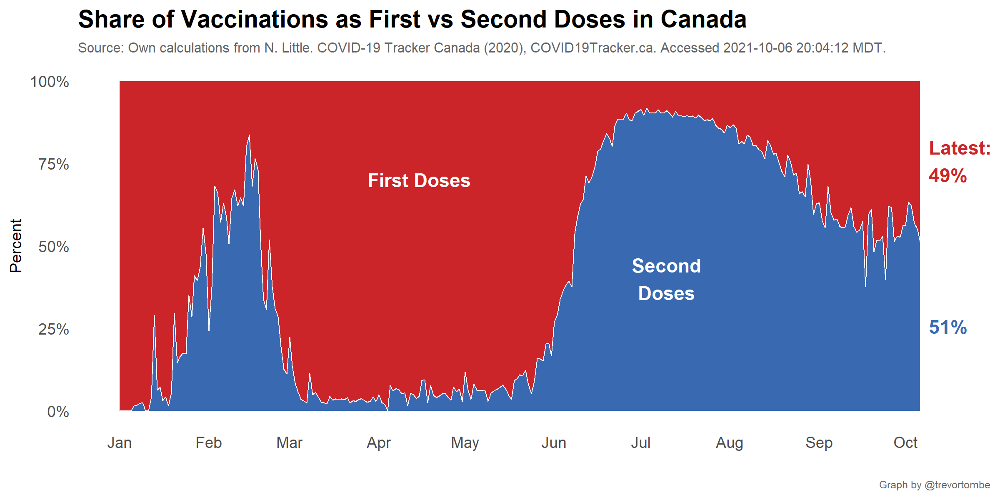

**Welcome!** This website provides several visualizations of COVID-19
vaccination progress in Canada based on data collected mainly from
[COVID Canada](https://covid19tracker.ca/vaccinationtracker.html) and
[Our World in Data](https://ourworldindata.org/covid-vaccinations). The
latest federal distribution schedule is [available
here](https://www.canada.ca/en/public-health/services/diseases/2019-novel-coronavirus-infection/prevention-risks/covid-19-vaccine-treatment/vaccine-rollout.html).
The information below was last updated at 2021-09-05 17:14:45 MDT. For
regular progress bar updates, follow
<a href="https://twitter.com/CDNVaccineCount" class="uri">@CDNVaccineCount</a>
on twitter. Note: I use the [Statistics Canada real-time population
estimates](https://www150.statcan.gc.ca/n1/pub/71-607-x/71-607-x2018005-eng.htm)
as the basis for most of shares reported on this site. Other sources may
differ for this reason.

COVID vaccination update for September 5, 2021:

-   Shots reported today: 64,956 (60% 2nd doses)
-   Total shots given: 53,811,309
-   Age 12+ w/ 1+ Shots: 84.1%
-   Age 18+ w/ 1+ Shots: 83.9% (est)
-   Shots per 100 people: 140.5
-   People fully vaccinated: 25,698,271
-   Doses distributed: 63,602,804
-   Share of distributed doses administered: 84.6%
-   Inventory: 99.8 days (at avg pace)

Source:
<a href="https://covid19tracker.ca/vaccinationtracker.html" class="uri">https://covid19tracker.ca/vaccinationtracker.html</a>

Note: Weekend updates are incomplete

Our 7-day average pace of giving shots: 98,097/day over the past week
and 106,455/day the week prior.Canada’s pace has slowed recently. We’re
now 82% below our June 30 peak average of 542,779. Though slower than
previously, we are currently on pace for 75%+ of those aged 12+ to be
fully vaccinated by September 5

And finally, dose counts and the share of a population with a shot is
informative and important, but the population-level effective protection
this provides is lower. One dose is less effective than two, plus there
are lags in the vaccine’s effect along with numerous uncertainties
(especially where the variants are concerned). Based on a first-dose
efficacy of between 40 to 80 percent with a 2-3 week lag and a second
dose efficacy of 90 to 95 percent with a 1 to 2 week lag, our current
coverage of effective protection is between 61 to 68 percent. The margin
of error here is wide, which reflects the high degree of variation in
efficacy estimates and uncertainty with new variants. This is meant to
provide intuition and rough magnitudes, it does not rigorous public
health guidance. Follow your local public health agency’s guidelines!

For a useful summary of the research literature, see [this report from
Public Health
Ontario](https://www.publichealthontario.ca/-/media/documents/ncov/covid-wwksf/2021/04/wwksf-vaccine-effectiveness.pdf?la=en).

------------------------------------------------------------------------

As the share of the population with their first dose is growing large,
provinces the number of second doses will accelerate and the interval
between jabs shrink. Here’s the latest:

Explore other visualizations by clicking on the appropriate menu item at
the top of this page. Enjoy!
