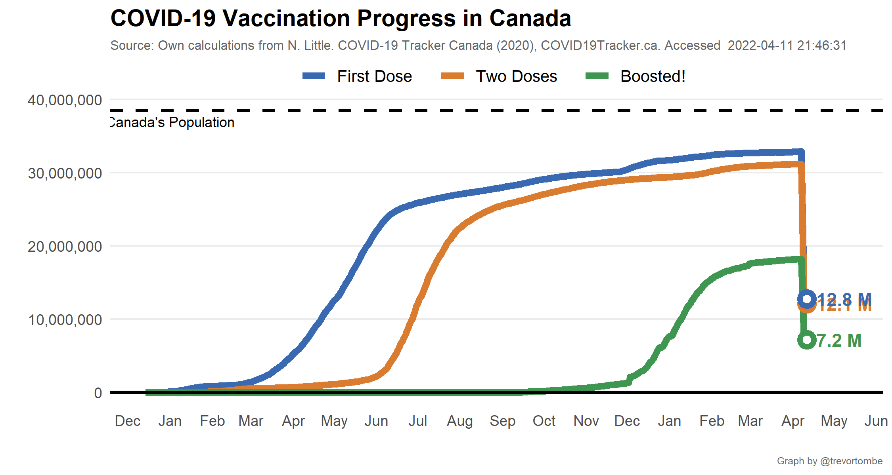

**Welcome!** This website provides several visualizations of COVID-19
vaccination progress in Canada based on data collected mainly from
[COVID Canada](https://covid19tracker.ca/vaccinationtracker.html) and
[Our World in Data](https://ourworldindata.org/covid-vaccinations). The
latest federal distribution schedule is [available
here](https://www.canada.ca/en/public-health/services/diseases/2019-novel-coronavirus-infection/prevention-risks/covid-19-vaccine-treatment/vaccine-rollout.html).
The information below was last updated at 2021-05-15 16:32:57 MDT. For
regular progress bar updates, follow
<a href="https://twitter.com/CDNVaccineCount" class="uri">@CDNVaccineCount</a>
on twitter.

COVID vaccination update for May 15, 2021:

-   Total shots given: 18,098,814
-   Shots per 100 people: 47.6
-   Shots reported today: 364,492
-   Doses distributed: 20,383,964
-   Share of distributed doses administered: 88.8%
-   Inventory: 6.5 days (at avg pace)
-   Age 12+ w/ 1+ Shots: 50.3%
-   People fully vaccinated: 1,395,516
-   Days to 75/20 target: 38

Source:
<a href="https://covid19tracker.ca/vaccinationtracker.html" class="uri">https://covid19tracker.ca/vaccinationtracker.html</a>

Note: Weekend updates are incomplete

Canada’s pace of vaccination:

Today’s 364,492 shots given compares to an average of 349,538/day over
the past week and 285,667/day the week prior.

-   Pace req’d for 2 doses to 75% of Canadians by Sept 30: 281,980
-   At current avg pace, we reach 75% by Sep 03

------------------------------------------------------------------------

Explore other visualizations by clicking on the appropriate menu item at
the top of this page. Enjoy!
