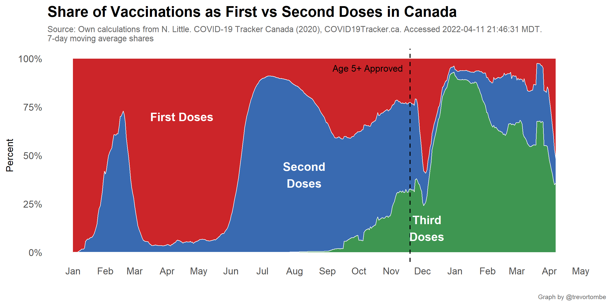
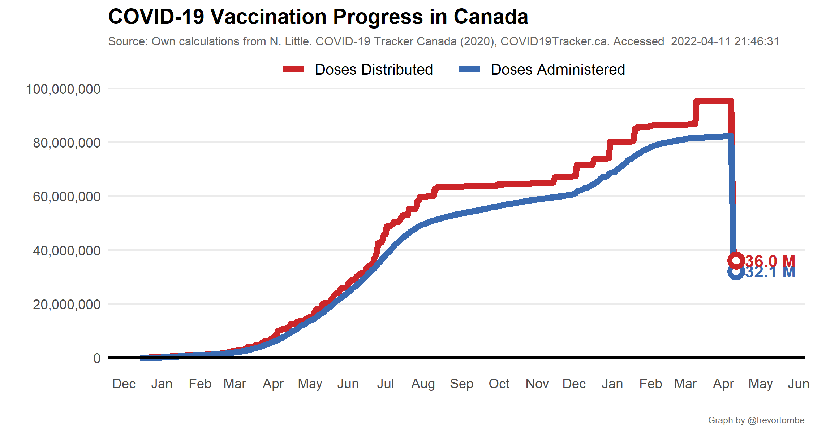

**Welcome!** This website provides several visualizations of COVID-19
vaccination progress in Canada based on data collected mainly from
[COVID Canada](https://covid19tracker.ca/vaccinationtracker.html) and
[Our World in Data](https://ourworldindata.org/covid-vaccinations). The
latest federal distribution schedule is [available
here](https://www.canada.ca/en/public-health/services/diseases/2019-novel-coronavirus-infection/prevention-risks/covid-19-vaccine-treatment/vaccine-rollout.html).
The information below was last updated at 2022-02-10 20:20:37 MDT. For
regular progress bar updates, follow
<a href="https://twitter.com/CDNVaccineCount" class="uri">@CDNVaccineCount</a>
on twitter. Note: I use the [Statistics Canada real-time population
estimates](https://www150.statcan.gc.ca/n1/pub/71-607-x/71-607-x2018005-eng.htm)
as the basis for most of shares reported on this site. Other sources may
differ for this reason.

------------------------------------------------------------------------

Explore other visualizations by clicking on the appropriate menu item at
the top of this page. Enjoy!
