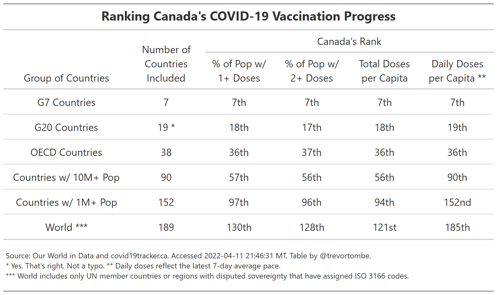

It is difficult (and sometimes not even useful) to compare vaccination efforts across countries. To help provide context, the following is a selection of several metrics looking at how Canada ranks globally. Pick your preferred measure!

