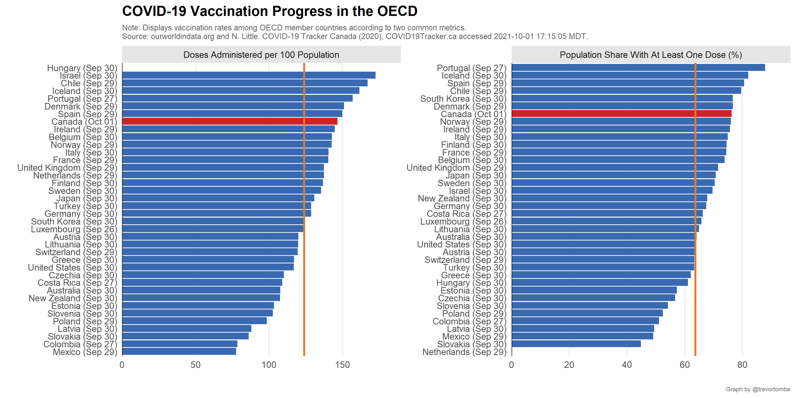
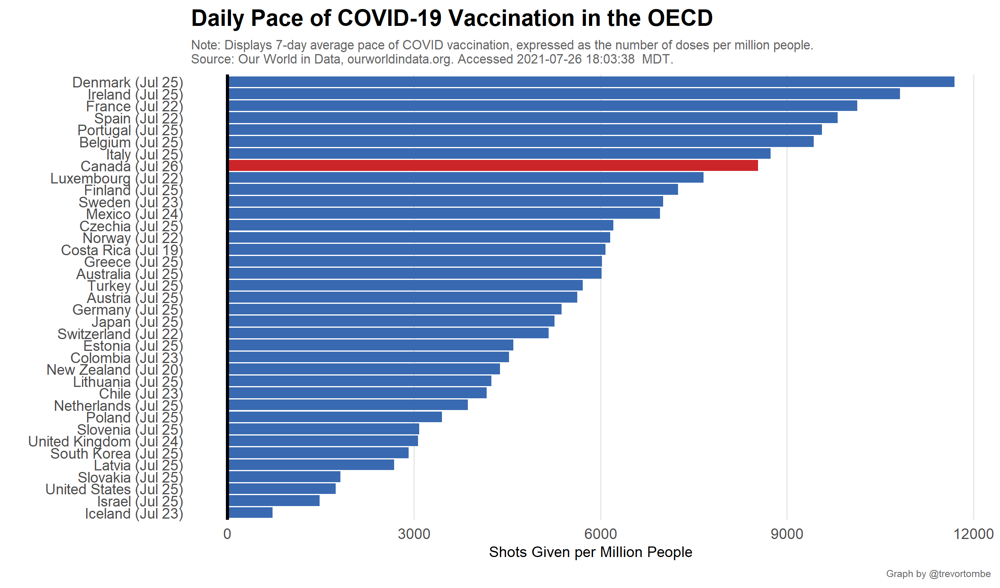

How does Canada compare to other developed economies? Here's a plot of the share of each country's population that has received at least one dose and the number of total vaccination doses delivered per capita.

How quickly are doses being delivered? Here's a comparison of the total doses being administered per day.

