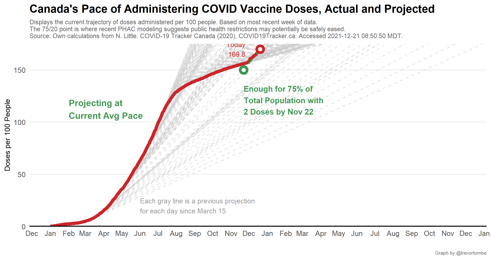
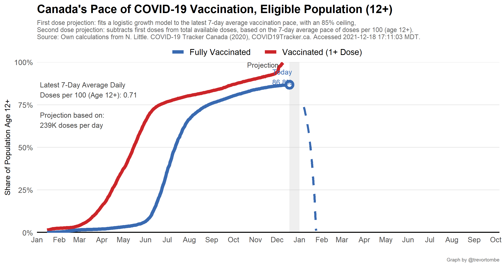

When might Canada achieve herd immunity? There is no specific vaccinate rate threshold, but 75 per cent is a common metric. And recent [federal government modeling](https://www.canada.ca/content/dam/phac-aspc/documents/services/diseases-maladies/coronavirus-disease-covid-19/epidemiological-economic-research-data/update-covid-19-canada-epidemiology-modelling-20210423-en.pdf) suggests health rules may be safely eased once 75 per cent of eligible individuals have at least one dose and 20 per cent have two. This requires approximately 31.5 million doses. Here's when we may have enough for that, and later for other milestones:

Projecting forward, the average doses administered per day is fairly stable. But as Canada's vaccination rate increases, the number of unvaccinated individuals declines and the pace of future increases in the share with at least one dose will naturally decline. To get a sense of when we might reach different vaccination rates, I construct a logistic growth process for vaccination rates, calibrated to the most recent week of daily doses administered and an 85 percent ceiling. This is the result:

---

Can the pace of vaccine administration be maintained? Here is prior vaccine deliveries to provinces combined with the latest schedule from the federal government. 

---

Provinces are also fairly consistent with one another in terms of where their trajectories are pointed. Here's the latest:

