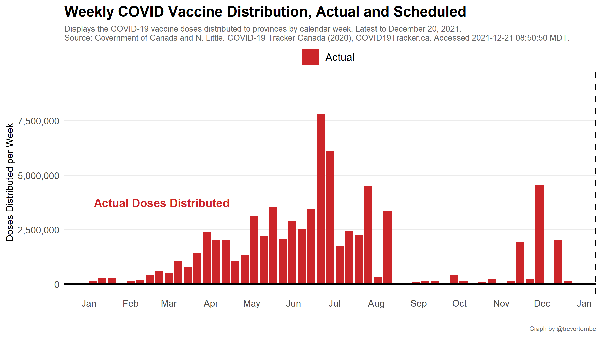

Recent [federal government modeling](https://www.canada.ca/content/dam/phac-aspc/documents/services/diseases-maladies/coronavirus-disease-covid-19/epidemiological-economic-research-data/update-covid-19-canada-epidemiology-modelling-20210423-en.pdf) suggests health rules may be safely eased once 75% of adults have at least one dose and 20% have two. This requires approximately 30 million doses. The following projection illustrates when that might be achieved.

---

