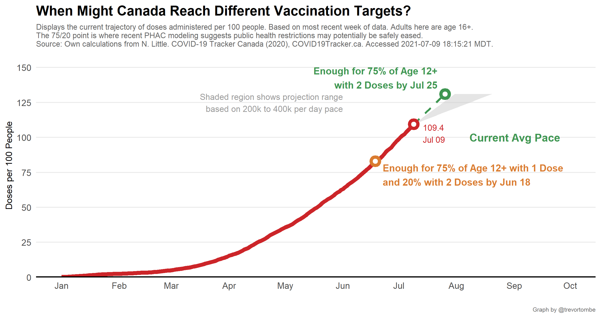
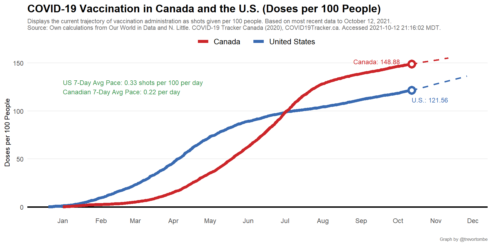

When might Canada achieve herd immunity? There is no specific vaccinate rate threshold, but 75 per cent is a common metric. This illustrates when Canada may achieve that for its entire population with at least one dose and for its adult population (age 16+).

---

But recent [federal government modeling](https://www.canada.ca/content/dam/phac-aspc/documents/services/diseases-maladies/coronavirus-disease-covid-19/epidemiological-economic-research-data/update-covid-19-canada-epidemiology-modelling-20210423-en.pdf) suggests health rules may be safely eased once 75 per cent of adults have at least one dose and 20 per cent have two. This requires approximately 30 million doses. The following projection illustrates when that might be achieved.

---

But deliveries are set to increase, allowing for a faster pace. Here's a projection that looks at a range of pace to provide a sense of when we might achieve not only the 75/20 target but also achieve 75 per cent of the adult population fully vaccinated.

---

Can the pace of vaccine administration be accelerated from here? Here is prior vaccine deliveries to provinces combined with the latest schedule from the federal government. 

---

Finally, Canada's current pace is faster than other jurisdictions. Here's a look at how far behind Canada is to the USA and the UK, and when our vaccination rates might match theirs.

