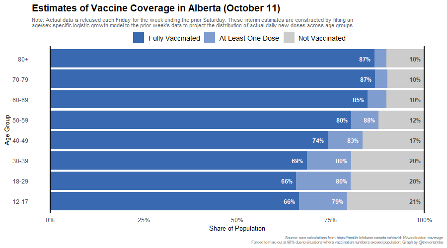
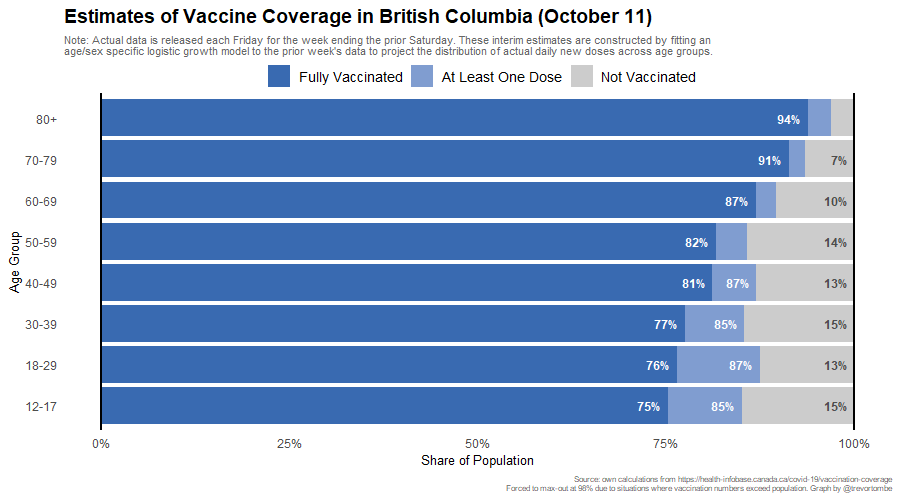
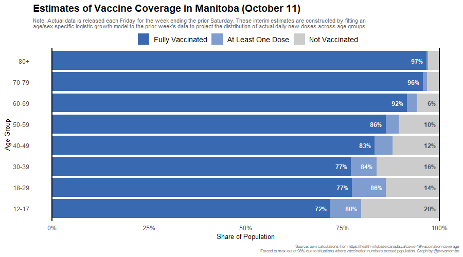
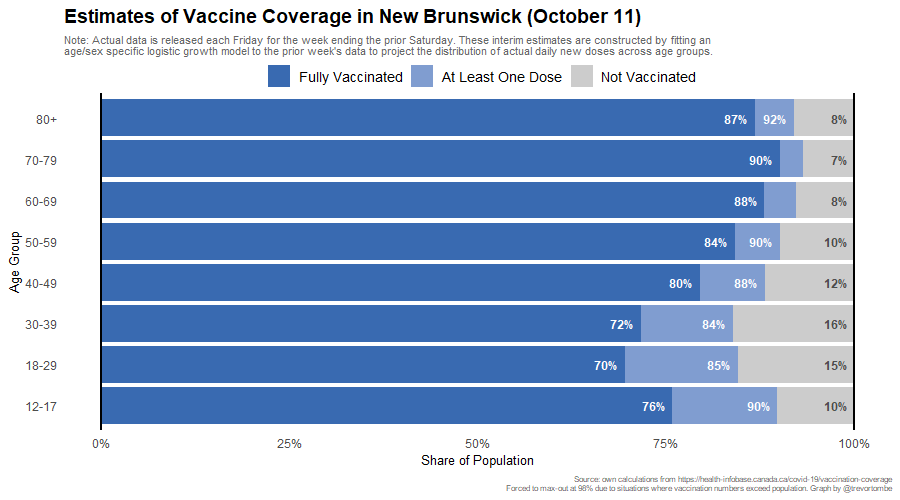
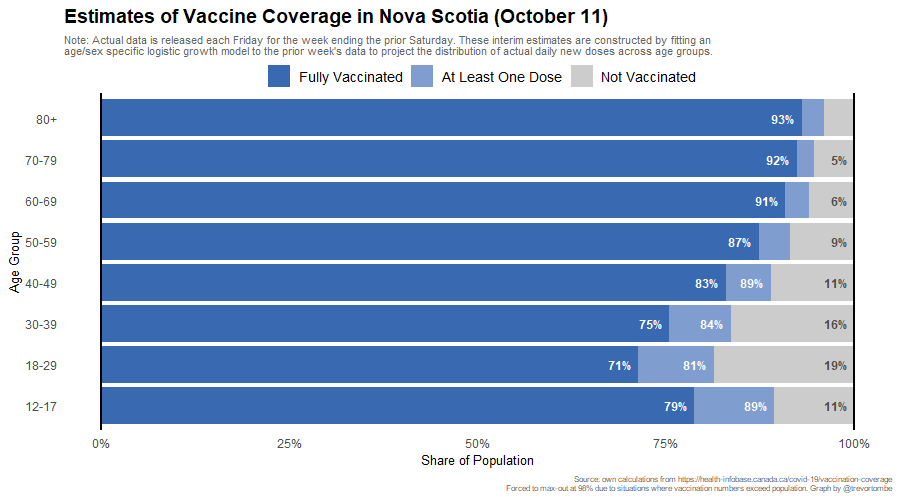
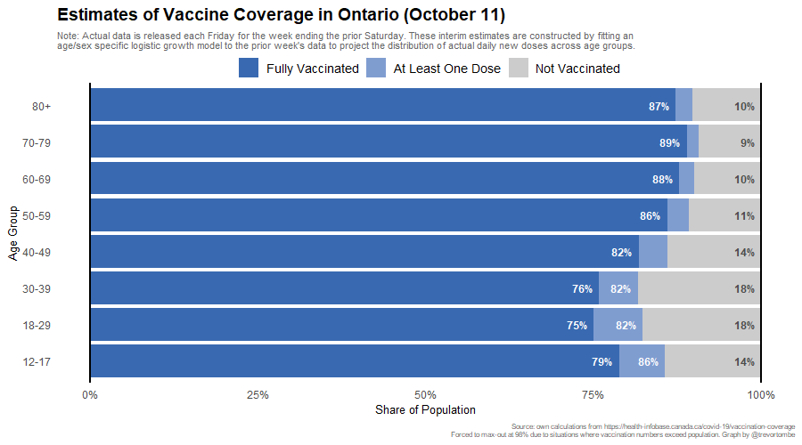
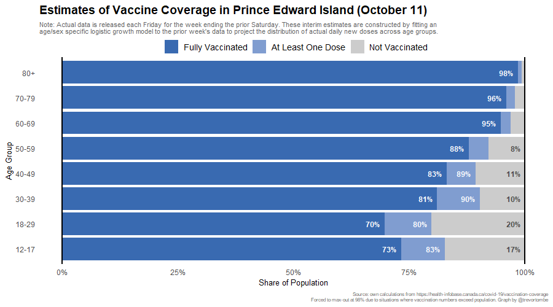
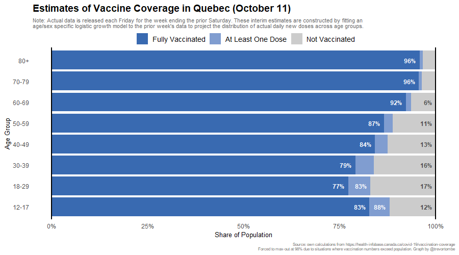
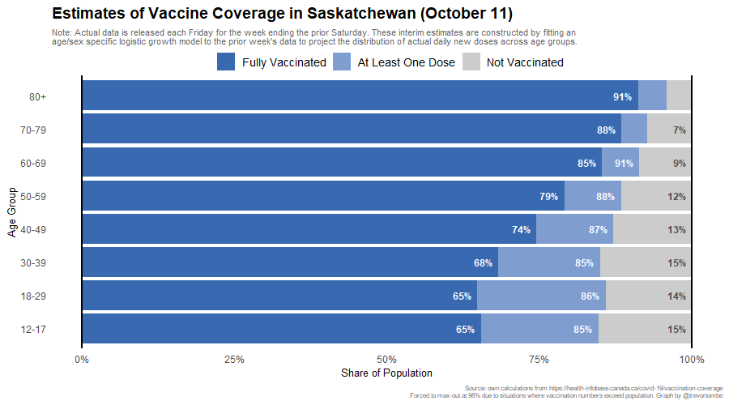

Note: Some provinces report daily age detail. These shares will differ slightly from those for two reasons: (1) I use real-time population estimates and (2) model error. Both differences should be minor.

