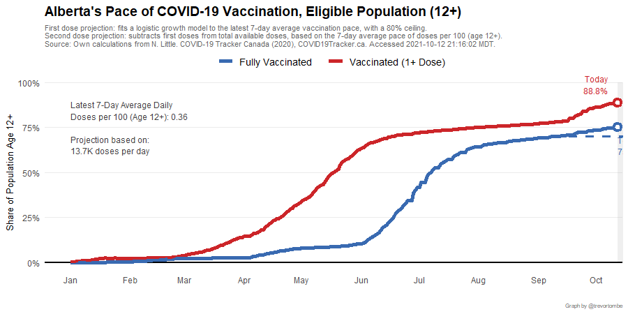
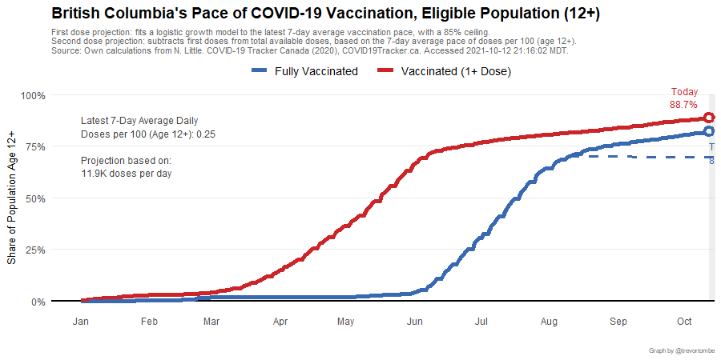
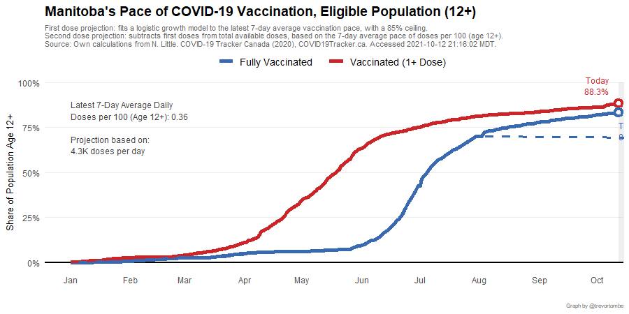
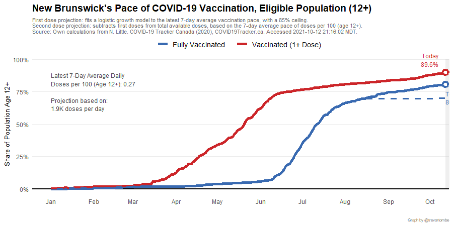
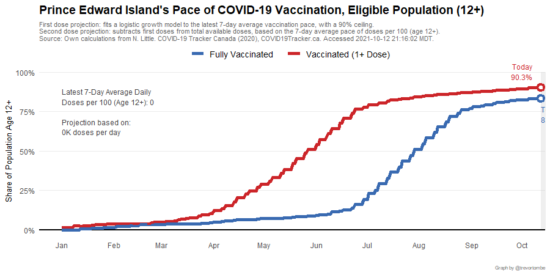
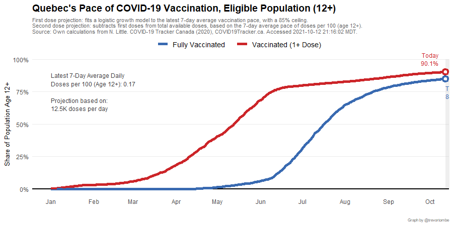

Note: Alberta's projection listed here may differ from what's listed in the `Alberta` page, since here I use Statistics Canada population data while in projecting Stage 3 reopening for Alberta I use the GOA values.

