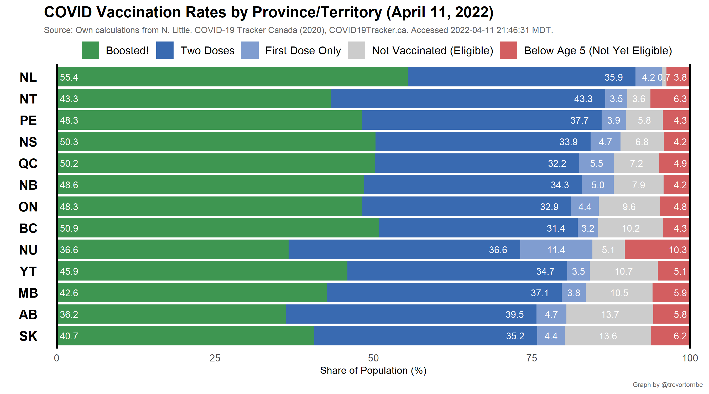
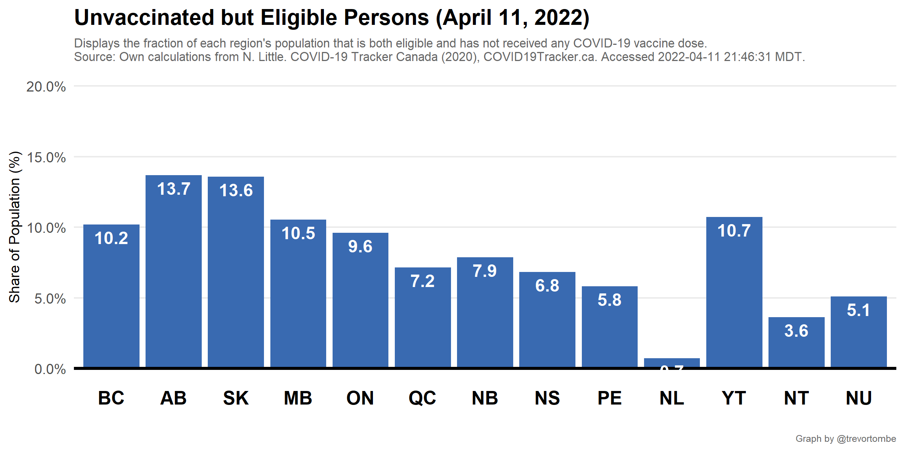
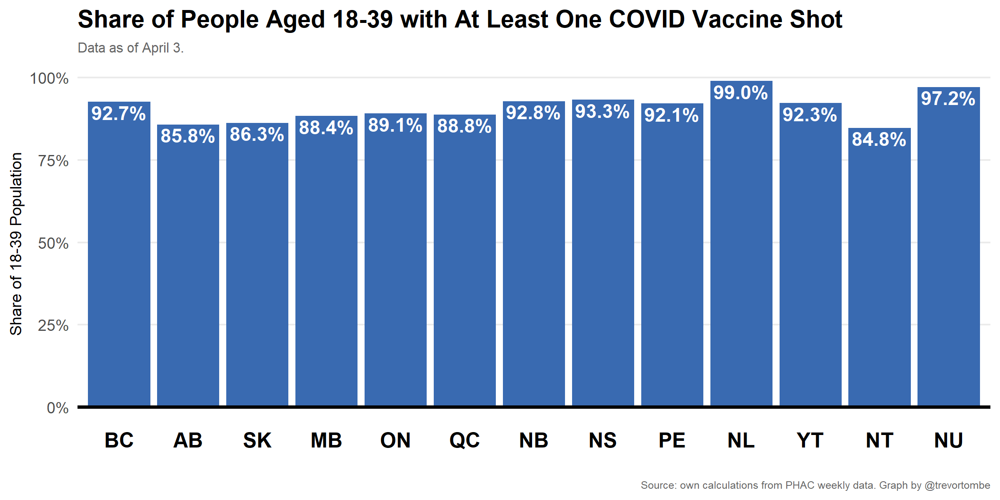
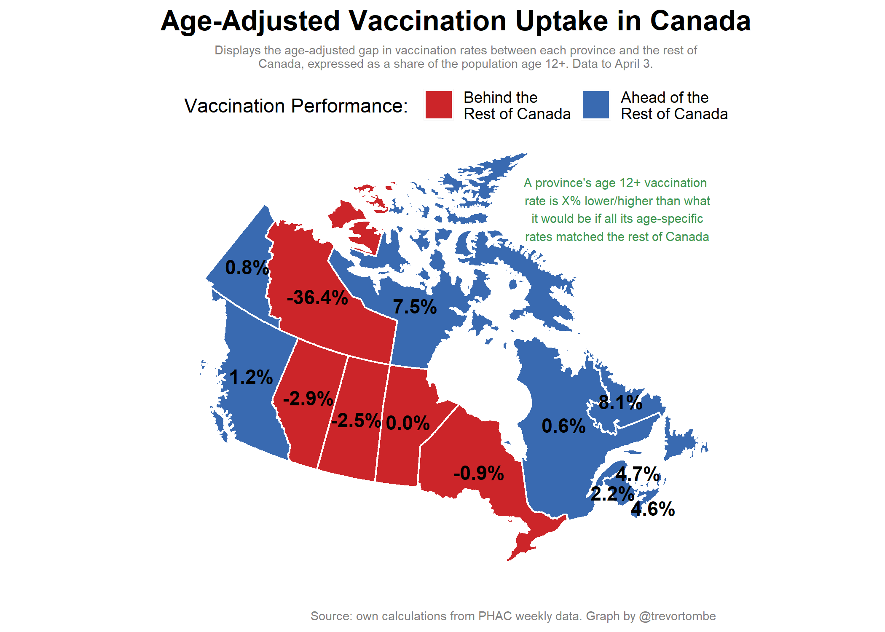
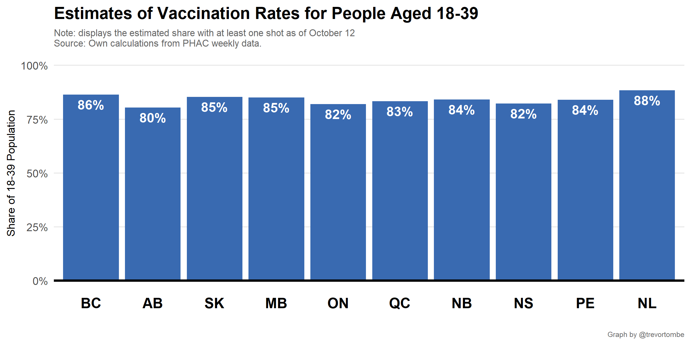
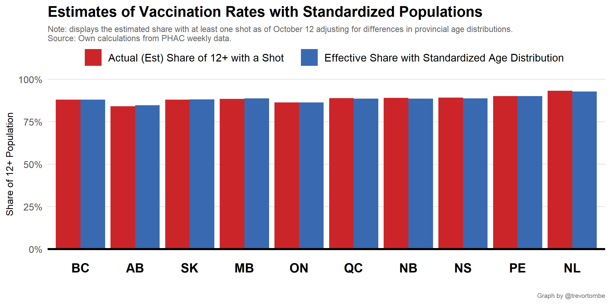
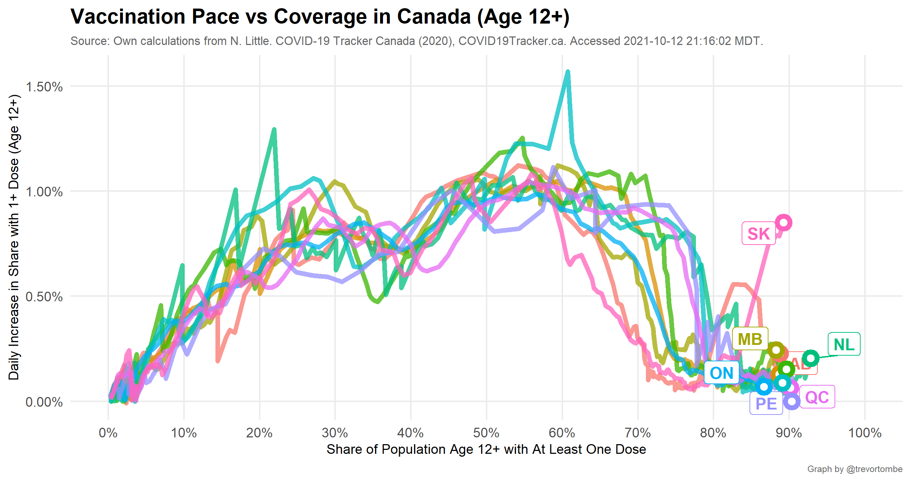

In Canada, vaccine doses are procured by the federal government and distributed to provinces for administration. Provinces set their own policies around who is eligible, length between first and second shots, and so on. To compare each province's vaccination rates, the plot below illustrates the share of each province's population with at least one dose over time and relative to the national average.

But while the above matters for vaccination coverage, it may not full reflect the performance of getting shots into arms if more second doses are administered relative to first doses. 

So a potentially better summary meausure is a comparison of the total doses per capita that have been administered, and the share of each province's deliveries from the federal government that have been used. This is illustrated below.

---

There is wide variation across provinces in the degree of vaccine hesitancy. Here's the fraction of each province and territories' population that both eligible for a COVID-19 shot but has not received one.

Differences across young people is particularly important. 

Across all ages, I estimate how much lower/higher each province's 12+ vaccination rate is compared to what it would be if all age categories equaled the rest of Canada.

#The above data comes with a long lag. Here are the latest experimental estimates projected forward from PHAC's delayed data.

#

It's worth noting that some provinces are younger than others, which will tend to shrink their 12+ share with a shot. But this effect is minor. To illustrate, I construct what the provincial 12+ share would be using each province's age-specific vaccination rates averaged at national population shares.

---

As the vaccination rates in each region increase, it is increasingly important to assess how quickly we are approaching the hesitant population and how quickly the pace of vaccinations will decline. Here's a comparison of vaccination rates versus first dose pace for each province.

---

A look at the share of deliveries that have been administered over time.

