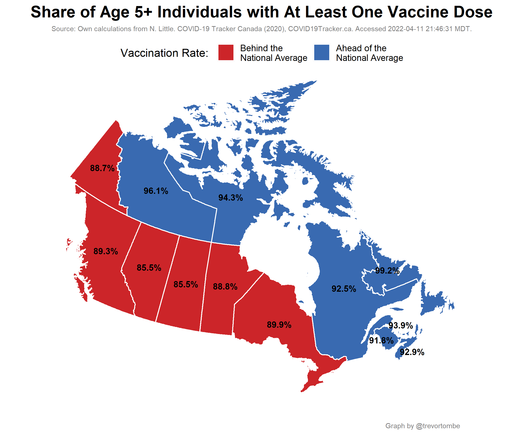
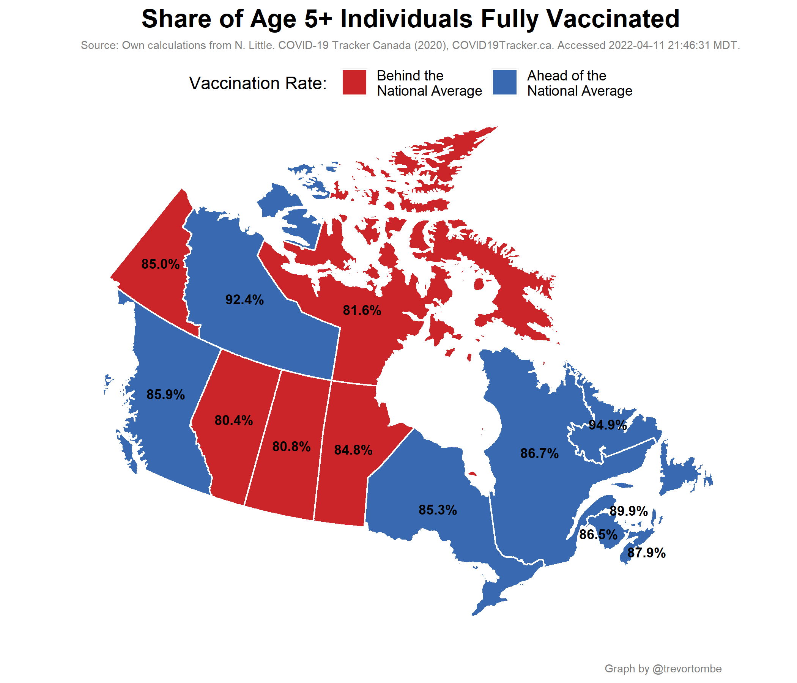
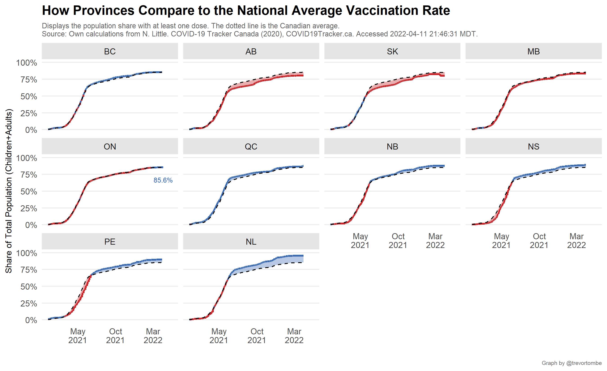

In Canada, vaccine doses are procured by the federal government and distributed to provinces for administration. Provinces set their own policies around who is eligible, length between shots, and so on. To compare each province's vaccination rates, the following plots illustrate several relevant metrics.

---

There is wide variation across provinces in the degree of vaccine hesitancy. Here's the fraction of each province and territories' population that both eligible for a COVID-19 shot but has not received one.

Differences across young people is particularly important. 

---

A look at the share of deliveries that have been administered over time.

