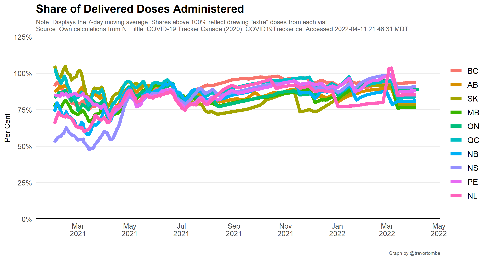

In Canada, vaccine doses are procured by the federal government and distributed to provinces for administration. Provinces set their own policies around who is eligible, length between first and second shots, and so on. To compare each province's vaccination rates, the plot below illustrates the share of each province's population with at least one dose over time and relative to the national average.

But while the above matters for vaccination coverage, it may not full reflect the performance of getting shots into arms if more second doses are administered relative to first doses. 

So a potentially better summary meausure is a comparison of the total doses per capita that have been administered, and the share of each province's deliveries from the federal government that have been used. This is illustrated below.

---

A look at the share of deliveries that have been administered over time.

