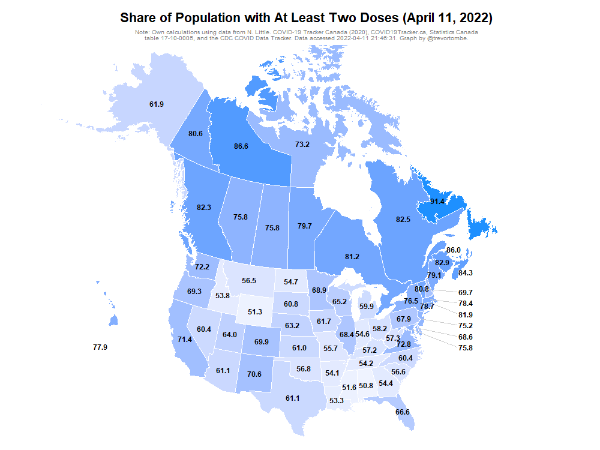

<iframe title="COVID Vaccination in Canada and the United States" aria-label="Map" id="datawrapper-chart-ThBRL" src="https://datawrapper.dwcdn.net/ThBRL/205/" scrolling="no" frameborder="0" style="width: 0; min-width: 100% !important; border: none;" height="622"></iframe>

---

This compares the share of each province, territory, and state's population that has received at least one dose as well as the share that is fully vaccinated.

